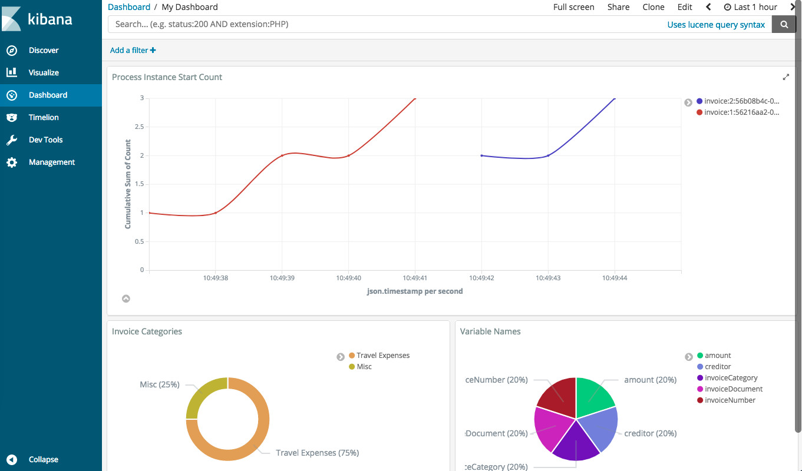
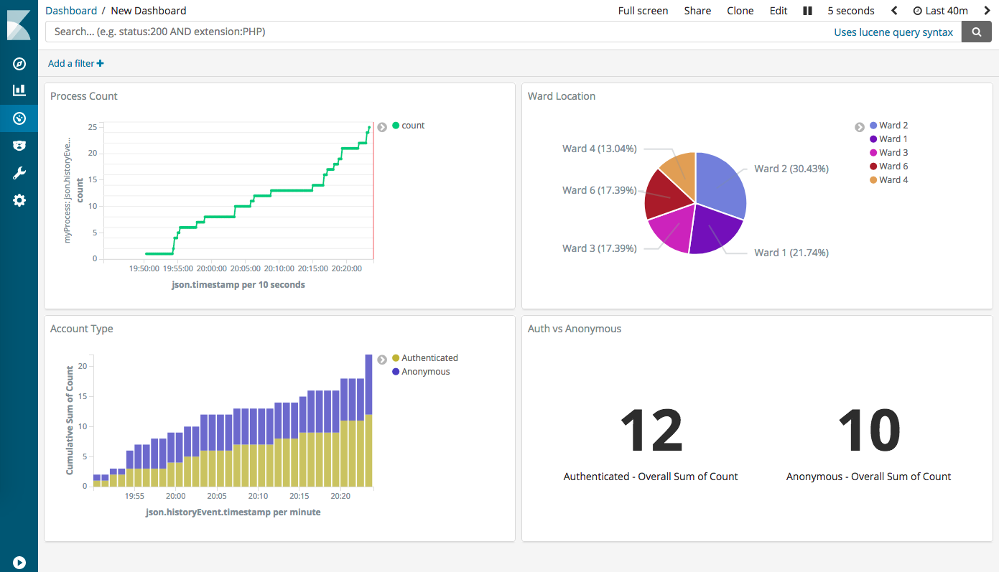
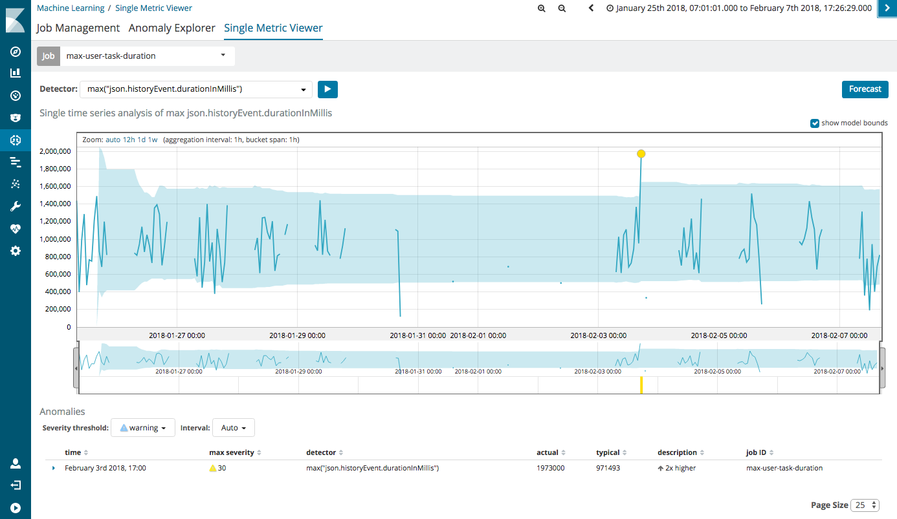

# Reporting
Reporting Microservices

# Kibana Camunda Reporting (Basic and AI/ML Machine Learning)

1. Example of Dashboard from Camunda Reporting

2. **Machine Learning** Analysis that detects anomalies in process data and variables:
